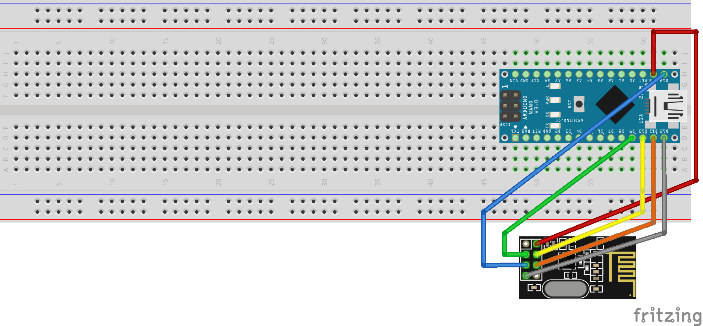
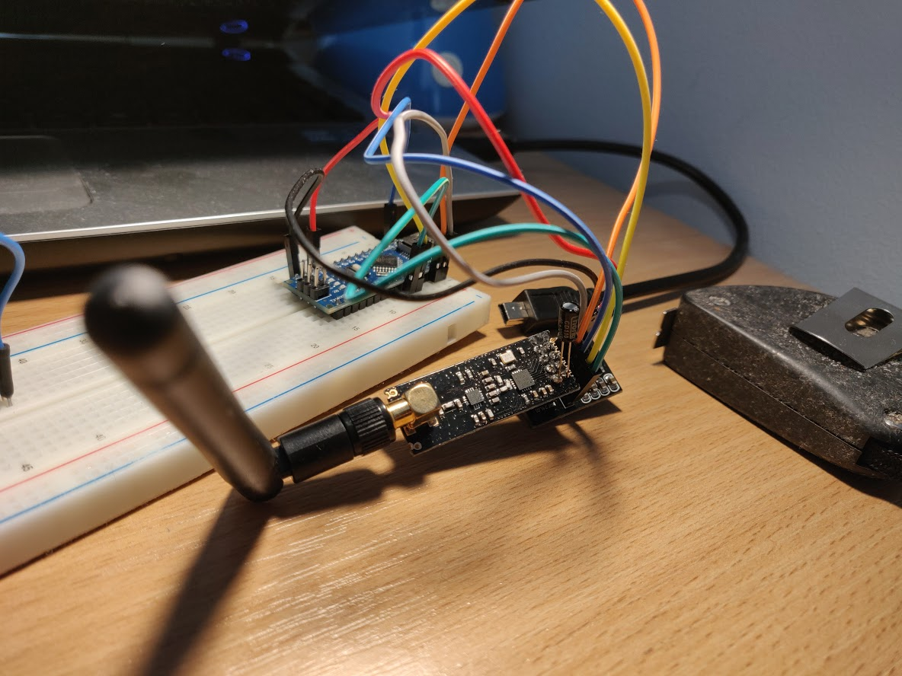

# simple_nrf24l01_communication
My first Arduino communication using nrf24l01.
The receiver and sender are connected in the same way.

Code for sender is available here [Sender code](docs/sender.code)
Code for receiver is available here [Receiver code](docs/receiver.code)

To reduce problem with voltage I have added capacitor 10uF and nrf24 adapter.

To make signal stronger I have used nrf24l01 + pa + lna.
Image of my project is bellow

